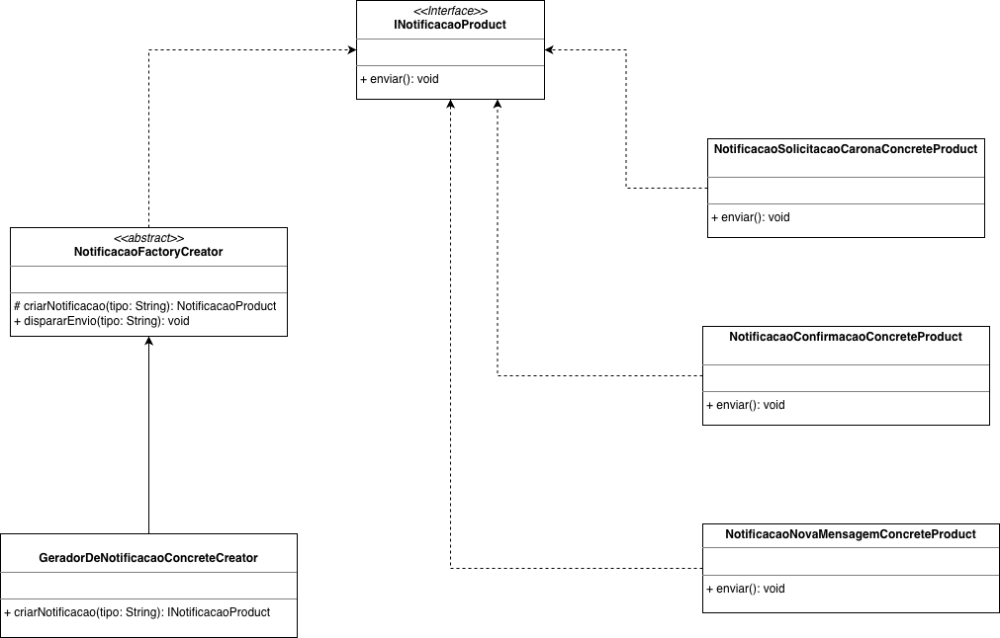
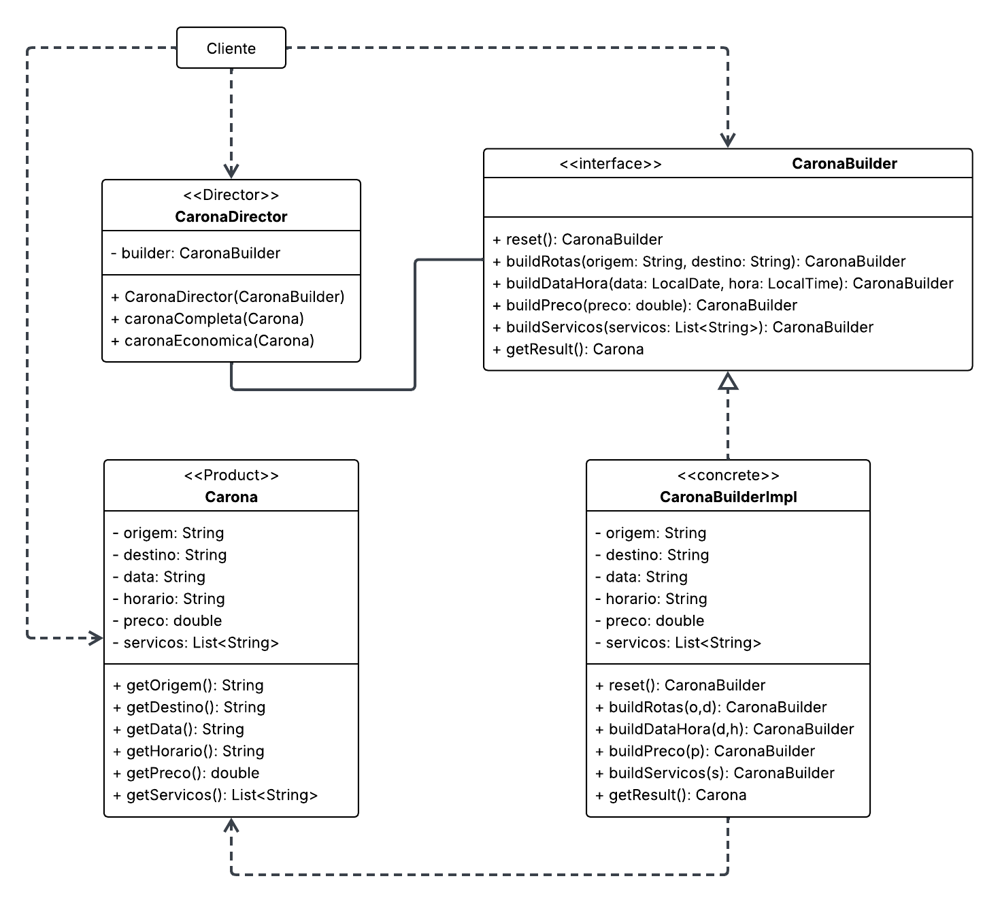
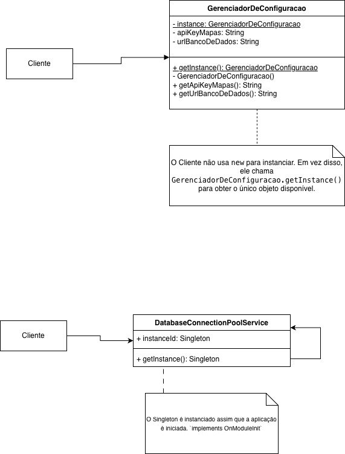

# 3.1. Módulo: Padrões de Projeto GoF Criacionais

## 1. Introdução

Os Padrões de Projeto GoF (Gang of Four), especificamente os **Padrões Criacionais**, oferecem soluções comprovadas para problemas relacionados à **criação e instanciação de objetos** em software orientado a objetos. Eles abstraem o processo de instanciação, tornando o sistema independente de como seus objetos são criados, compostos e representados. O uso destes padrões ajuda a reduzir o acoplamento entre as classes, aumenta a flexibilidade e promove a extensibilidade do código, encapsulando a complexidade da criação de objetos.

No contexto do projeto **CaronaAmigaFCTE**, a gestão da criação de certos objetos é crucial. Como observado nos diagramas do projeto (Diagrama de Classes, Atividades e Pacotes), o fluxo de notificações para passageiros e motoristas é uma funcionalidade central. Este fluxo tende a evoluir, com novos tipos de mensagens (solicitação, confirmação, rejeição, nova mensagem no chat, avaliação), canais de envio ou regras de negócio a serem adicionados. Adotar um padrão criacional adequado permite que a equipe de desenvolvimento incorpore estas variações futuras com menor impacto no código existente, evitando refatorações complexas e mantendo o sistema coeso.

## 2. Metodologia 

A seleção e aplicação dos padrões criacionais neste projeto seguiram um processo estruturado, combinando análise técnica com trabalho colaborativo em equipe. Iniciámos com uma análise detalhada dos requisitos funcionais e dos diagramas de arquitetura (Diagrama de Atividades, Diagrama de Classes e Diagrama de Pacotes) para identificar pontos no sistema onde a criação de objetos poderia gerar complexidade ou forte acoplamento. O **Diagrama de Atividades** revelou a necessidade de notificações em fluxos chave como "Pedir Carona" e "Cadastrar Conta", enquanto o **Diagrama de Classes** confirmou a existência das entidades `Notificacao` e `Mensagem`, e o **Diagrama de Pacotes** apontou para um `ServicoDeNotificacao` desacoplado. Com base nesta análise, realizámos uma discussão técnica comparando os principais padrões criacionais GoF (Factory Method, Abstract Factory, Builder, Singleton, Prototype) à luz dos princípios SOLID que norteiam o projeto.

A equipe foi dividida em três grupos para aprofundar o estudo e a documentação dos padrões criacionais mais relevantes identificados, seguindo uma divisão similar à utilizada para as modelagens. A responsabilidade pela documentação detalhada de cada padrão foi distribuída conforme a tabela abaixo:

| Grupo     | Responsabilidade                                                                                                 | Integrantes                                                                                            |
| :-------- | :--------------------------------------------------------------------------------------------------------------- | :----------------------------------------------------------------------------------------------------- |
| **Grupo 1** | Detalhar e documentar a aplicação do **Factory Method**, incluindo modelagem UML e implementação Java de referência. | Kaleb Macedo, Lucas Monteiro Freitas e Othavio Bolzan.                                                  |
| **Grupo 2** | Pesquisar e documentar o padrão **Builder**, incluindo modelagem UML e implementação Java de referência.               | Amanda Cruz, Arthur Sousa e Cauã Araujo.                                                               |
| **Grupo 3** | Pesquisar e documentar o padrão **Singleton**, incluindo modelagem UML e implementação Java de referência.          | Caio Venâncio, Caio Melo, Maria Eduarda e Pedro Henrique.                                              |

<b></b> Divisão das Equipes para Documentação dos Padrões Criacionais

Esta divisão permitiu que cada subgrupo se concentrasse num padrão específico, garantindo uma cobertura detalhada dos três GoFs criacionais selecionados. Enquanto o Grupo 1 focava na implementação prática e validação do Factory Method (compilando o código com Maven e gerando o artefacto `.jar`), os Grupos 2 e 3 focavam na pesquisa teórica e de implementação na descrição dos padrões Builder e Singleton, respectivamente. Todo o material produzido foi posteriormente consolidado neste documento, assegurando uma apresentação coesa e completa dos padrões criacionais estudados.

## 3. Padrões Criacionais GoF: Teoria e Aplicação

### 3.1. O que são Padrões Criacionais GoF?

Os Padrões Criacionais GoF resolvem problemas relacionados ao *como*, *quando* e *quem* deve criar objetos. Em vez de permitir que o código cliente instancie classes concretas diretamente (usando `new`), o que gera forte acoplamento, estes padrões encapsulam o processo de criação. O cliente passa a depender de interfaces ou classes abstratas, tanto para solicitar a criação quanto para interagir com o objeto criado.

Esta abordagem traz várias vantagens: Flexibilidade, Extensibilidade (Princípio Aberto/Fechado), Coesão e Controlo sobre a instanciação.

Os principais padrões deste grupo são:
* **Factory Method:** Delega a subclasses a decisão de qual produto concreto instanciar.
* **Abstract Factory:** Agrupa vários factory methods para criar famílias de objetos relacionados.
* **Builder:** Separa a construção passo a passo de um objeto complexo da sua representação final.
* **Prototype:** Permite criar novos objetos copiando (clonando) uma instância existente.
* **Singleton:** Garante que uma classe tenha apenas uma única instância e fornece um ponto de acesso global a ela.

### 3.2. Detalhes de Padrões Selecionados

A seguir, aprofundamos a explicação de três padrões criacionais relevantes.

#### 3.2.1. Singleton

* **Objetivo:** Garantir que uma classe tenha **apenas uma instância** e fornecer um **ponto de acesso global** a essa instância.
* **Motivação:** Útil para gerir recursos partilhados ou configurações globais, como gestores de ligação à base de dados, ficheiros de log, ou definições de configuração da aplicação. Ter múltiplas instâncias poderia causar inconsistências ou sobrecarga. No CaronaAmigaFCTE, poderia ser aplicado, por exemplo, a uma classe responsável por carregar e fornecer configurações gerais da aplicação (como chaves de API externas ou parâmetros de sistema) que devem ser consistentes em todo o sistema.
* **Estrutura Típica:** Implementado com um **construtor privado**, um **atributo estático privado** para guardar a única instância, e um **método estático público (`getInstance()` ou `instance()`)** que controla a criação (geralmente *lazy loading*) e devolução da instância única. Atenção especial é necessária para garantir a segurança em ambientes com múltiplas threads.
* **Benefícios:** Controlo explícito sobre a instanciação única; Ponto de acesso global; Permite *lazy initialization*.
* **Desvantagens:** Pode introduzir acoplamento global, dificultando a testabilidade; Viola o Princípio da Responsabilidade Única se fizer mais do que gerir a sua instância; Requer cuidado em ambientes concorrentes.

#### 3.2.2. Factory Method (Aplicado no CaronaAmigaFCTE)

* **Objetivo:** Definir uma interface para criar um objeto, mas **deixar que as subclasses decidam qual classe concreta instanciar**. Permite adiar a instanciação para as subclasses.
* **Motivação no Projeto:** O sistema CaronaAmigaFCTE precisa de enviar vários tipos de notificações (Solicitação, Confirmação, Nova Mensagem, etc.). O Factory Method permite que o código que dispara a notificação (ex: o `ServicoDeNotificacao`) não precise de conhecer as classes concretas. Ele apenas pede à "fábrica" (`GeradorDeNotificacaoConcreteCreator`) para criar uma notificação de um certo `tipo`. Isto promove baixo acoplamento e facilita a adição de novos tipos de notificação no futuro sem modificar o código cliente.

* **Participantes (conforme nomenclatura solicitada):**
    * **Product (`INotificacaoProduct`):** A interface comum para todas as notificações (ex: método `enviar()`).
    * **ConcreteProduct (`NotificacaoSolicitacaoCaronaConcreteProduct`, etc.):** As classes concretas para cada tipo de notificação, implementando a interface `Product`.
    * **Creator (`NotificacaoFactoryCreator`):** A classe abstrata que declara o `factoryMethod()` (ex: `criarNotificacao`).
    * **ConcreteCreator (`GeradorDeNotificacaoConcreteCreator`):** A classe que implementa o `factoryMethod()` e contém a lógica para instanciar o `ConcreteProduct` correto (ex: usando `switch case` baseado no tipo).

* **Fluxo de Execução:**
    1.  O código cliente instancia um `GeradorDeNotificacaoConcreteCreator`.
    2.  O cliente chama um método no `Creator` (ex: `dispararEnvio("TIPO_DESEJADO")`).
    3.  Este método invoca o `factoryMethod` (`criarNotificacao("TIPO_DESEJADO")`).
    4.  O `ConcreteCreator` executa a sua lógica e retorna uma instância do `ConcreteProduct` apropriado (ex: `NotificacaoSolicitacaoCaronaConcreteProduct`), através da interface `INotificacaoProduct`.
    5.  O método original no `Creator` recebe esta instância e chama o método do `Product` (ex: `enviar()`), executando a lógica específica da notificação sem conhecer a classe concreta.

* **Benefícios no CaronaAmigaFCTE:** Extensibilidade (adicionar novos tipos de notificação é fácil); Baixo Acoplamento (cliente não depende das classes concretas); Coesão (lógica de criação centralizada).

#### 3.2.3. Builder

* **Objetivo:** Separar o processo de **construção de um objeto complexo** da sua representação final, de modo que o mesmo processo de construção possa criar **diferentes representações**. Permite construir objetos complexos passo a passo.
* **Motivação:** Quando um objeto possui muitos atributos (alguns obrigatórios, outros opcionais) ou sua criação envolve múltiplas etapas, usar construtores com longas listas de parâmetros torna-se confuso e propenso a erros. O Builder oferece uma API fluente (métodos encadeados) e mais legível para configurar o objeto antes de o construir definitivamente com um método `build()`. No CaronaAmigaFCTE, a classe `Carona` do Diagrama de Classes (com origem, destino, data, hora, preço, serviços opcionais, etc.) é um bom candidato para este padrão.
* **Estrutura Típica:**
    * **`Builder` (Interface/Abstrato):** Define métodos para configurar cada parte do objeto (ex: `setOrigem(String)`). Geralmente retornam `this` para encadeamento. Inclui um método final `build()`.
    * **`ConcreteBuilder`:** Implementa a interface `Builder`, mantendo o estado do objeto em construção e realizando a instanciação final no `build()`.
    * **`Product`:** O objeto complexo a ser criado (ex: `Carona`).
    * **`Director` (Opcional):** Orquestra a sequência de chamadas ao `Builder` para construções padrão.
* **Benefícios:** Melhora a **legibilidade** do código de criação; Permite criar objetos **imutáveis** facilmente; Permite **validações** centralizadas no `build()`; Facilita a criação de diferentes representações.
* **Desvantagens:** Aumenta o número de classes; Pode ser "verboso" para objetos simples.

## 4. Modelagens 

### GoF Criacional: Factory Method

 Tabela 1 -<a href="https://drive.google.com/file/d/14k7sLGfINwjet-qUjva8B469cGeq20KC/view?usp=sharing">Modelagem do Factory Method</a> 

<b>Fonte: </b>Autoria de <a href="https://github.com/kalebmacedo">Kaleb Macedo</a>, <a href="https://github.com/LucasMF1">Lucas Monteiro Freitas</a> e <a href="https://github.com/bolzanMGB">Othavio Bolzan</a>

### Gof Criacional: Builder 

 Tabela 2 -<a href="https://drive.google.com/file/d/14k7sLGfINwjet-qUjva8B469cGeq20KC/view?usp=sharing">Modelagem do Builder</a> 

<b>Fonte: </b>Autoria de <a href="https://github.com/mandicrz"> Amanda Cruz</a>, <a href="https://github.com/tutzs"> Arthur Sousa</a>, <a href="https://github.com/caua08"> Cauã Araujo</a>

### Gof Criacional: Singleton

 Tabela 3 -<a href="https://drive.google.com/file/d/14k7sLGfINwjet-qUjva8B469cGeq20KC/view?usp=sharing">Modelagem do Singleton</a> 

<b>Fonte: </b>Autoria de <a href="https://github.com/caio-venancio">Caio Venâncio</a>, <a href="https://github.com/pyramidsf">Maria Eduarda</a>, <a href="ttps://github.com/CaioMelo25">Caio Melo</a> e <a href="https://github.com/pedro-hsf">Pedro Henrique</a>

## 5. Referências

* SERRANO, Milene. **Aula - GOFS CRIACIONAIS**. Material de Aula. Arquitetura e Desenho de Software, UnB Gama, 2025.

## 6. Histórico de Versões

| Versão | Data       | Descrição                                    | Autor                                          | Revisor |
| :----: | ---------- | -------------------------------------------- | ---------------------------------------------- | ------- |
|  `1.0` | 20/09/2025 | Criação da estrutura do Documento            | [Kaleb Macedo](https://github.com/kalebmacedo) |         |
|  `1.1` | 20/09/2025 | Documentou o arquivo                      | [Kaleb Macedo](https://github.com/kalebmacedo), [Lucas Monteiro](https://github.com/LucasMF1) e [Othavio Bolzan](https://github.com/bolzanMGB) |         |
|  `1.2` | 20/09/2025 | Adição das modelagens dos outros grupos            | [Kaleb Macedo](https://github.com/kalebmacedo) |         |
