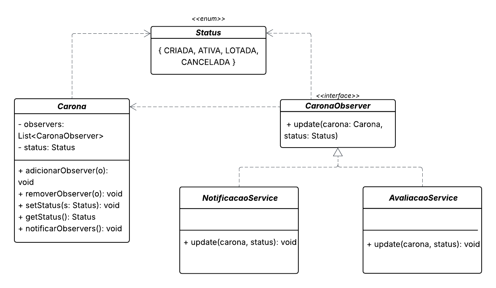

# Carona Amiga

**Código da Disciplina**: FGA0208 
**Número do Grupo**: G2 - CaronaAmigaFCTE 
**Entrega**: 01 

## Alunos
| Matrícula   | Aluno                                         |
|-------------|-----------------------------------------------|
| 231027023   | Amanda Cruz Lima                              |
| 221022462   | Arthur da Silveira Sousa                      |
| 211030952   | Caio Melo Borges                              |
| 231027195   | Caio Venâncio do Rosário                      |
| 221022490   | Cauã Araujo dos Santos                        |
| 231026975   | Kaleb de Souza Macedo                         |
| 231035446   | Lucas Monteiro Freitas                        |
| 231026483   | Maria Eduarda de Amorim Galdino               |
| 231039150   | Othavio Araujo Bolzan                         |
| 211063229   | Pedro Henrique dos Santos Ferreira            |

## Sobre 
CaronaAmigaFCTE tem como objetivo o desenvolvimento de um aplicativo de caronas voltado para a comunidade acadêmica da Universidade de Brasília – Campus Gama (FCTE). A iniciativa surge da necessidade de propor uma alternativa de mobilidade eficiente, colaborativa e sustentável para os alunos, considerando que muitos residem longe do campus e enfrentam dificuldades com os horários e a qualidade do transporte público disponível.

## Screenshots da Terceira Entrega

### GoF Observer

### GoF Builder

### GoF Facade

## Há algo a ser executado?

( ) SIM

( ) NÃO

Se SIM, insira um manual (ou um script) para auxiliar ainda mais os interessados na execução.

## Histórico de Versões

| Versão | Data       | Descrição                             | Autor                                                 | Revisor                                               |
| :----: | ---------- | ---------------------------           | ----------------------------------------------------- | ----------------------------------------------------- |
| `1.0`  | 14/10/2025 | Criação do documento                  |  [Arthur](https://github.com/Tutzs)                   |                                                       | 